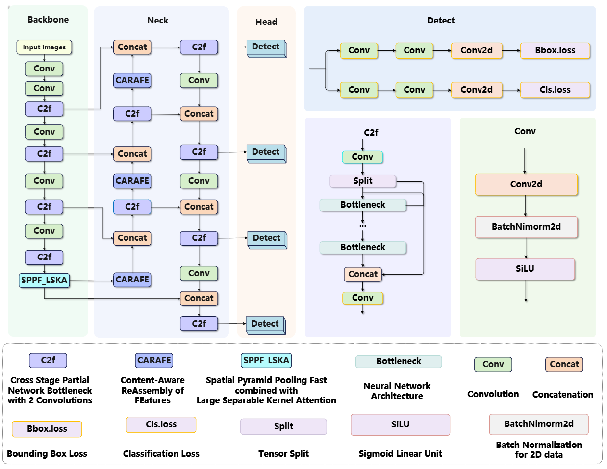

# STD-YOLO: A Small Ship Target Detection Model with Enhanced Information Association Mechanism

Official PyTorch implementation of the paper: **STD-YOLO: A Small Ship Target Detection Model with Enhanced Information Association Mechanism**.

---

## 📌 Overview

Remote sensing technology provides valuable wide-area information, facilitating target detection in large-scale regions. However, due to high background noise, multi-scale target characteristics, and the difficulty of distinguishing target information from complex backgrounds, modern detectors suffer from high rates of missed detections and false positives, especially for small targets. 

**STD-YOLO** is an advanced remote sensing small target detection framework based on an improved **YOLOv8** model. By introducing an enhanced information association mechanism, it mitigates feature loss in deep convolutional layers and significantly boosts multi-scale contextual awareness.

---

## 🏗️ Model Architecture



*The framework of the proposed STD-YOLO network. We add a detection layer specifically for small objects, modify the SPPF module, and use the CARAFE upsampling operator to enhance the model's receptive field and improve its feature extraction capability.*

---

## 🛠️ Installation

### Prerequisites
- Linux or Windows
- Python >= 3.8
- PyTorch >= 1.12
- CUDA >= 11.3 (Highly Recommended)

### Setup Environment

1. Clone this repository:
   ```bash
   git clone [https://github.com/STD-YOLO.git](https://github.com/STD-YOLO.git)
   cd STD-YOLO
2. Create and activate an isolated virtual environment:
    ```bash
    conda create -n stdyolo python=3.9 -y
    conda activate stdyolo

    ```


3. Install requirements (including the core framework and necessary operators):
    ```bash
    pip install -r requirements.txt

    ```


---

## 📊 Dataset Preparation

The repository supports datasets in the standard **YOLO text format**. Please organize your remote sensing/radar dataset (e.g., SSDD, SAR-Ship-Dataset) as follows:

```text
dataset/
├── images/
│   ├── train/
│   │   ├── img_001.jpg
│   │   └── ...
│   └── val/
│       ├── img_002.jpg
│       └── ...
└── labels/
    ├── train/
    │   ├── img_001.txt
    │   └── ...
    └── val/
        ├── img_002.txt
        └── ...

```

Modify the data configuration file `data/ship_dataset.yaml`:

```yaml
path: ../dataset # path to your dataset root
train: images/train
val: images/val

# Class Names
names:
  0: ship

```

---

## 🚀 Usage Guide

### 1. Training

To train the **STD-YOLO** model from scratch or using pretrained weights on your dataset, run:

```bash
python train.py --model ultralytics/cfg/models/v8/yolov8-std-yolo.yaml --data data/ship_dataset.yaml --epochs 200 --batch 16 --img 640 --device 0

```

### 2. Evaluation / Validation

To validate the trained model's performance (mAP@0.5, mAP@0.5:0.95, FPS) on the validation set:

```bash
python val.py --weights runs/detect/train/weights/best.pt --data data/ship_dataset.yaml --img 640 --device 0

```

### 3. Inference / Prediction

To detect small ship targets in your own remote sensing images:

```bash
python predict.py --weights runs/detect/train/weights/best.pt --source path/to/your/test/images/ --img 640 --device 0

```

---
